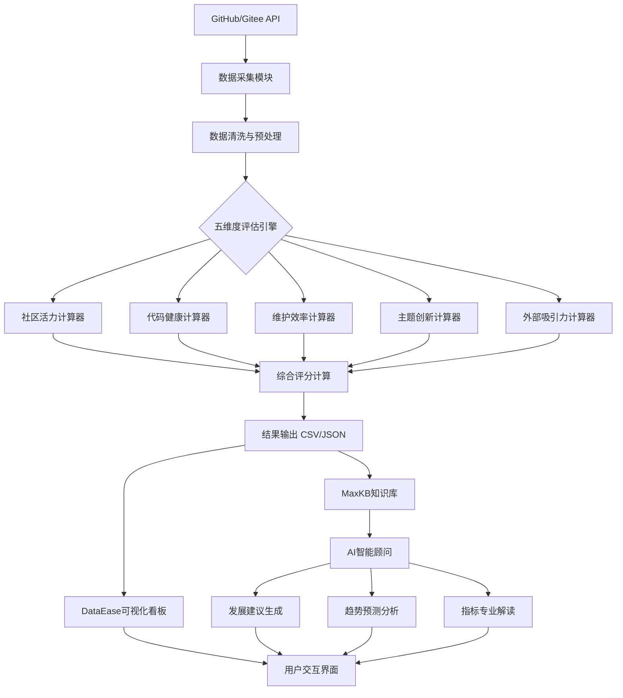

# OpenRank-StepByStep-Spark
Spark-新生代优质项目早期预测系统
# 开源生态系统中新生代优质项目的早期预测与智能顾问系统


## 🚀 项目简介

**开源生态系统中新生代优质项目的早期预测与智能顾问系统**是一个集数据采集、多维度评估、可视化分析与AI智能建议于一体的完整解决方案。系统能够对创建6-18个月的开源项目进行精准评估，识别具有潜力的"明日之星"，并提供数据驱动的成长建议。

### 🌟 核心亮点
- **五维度量化评估**：社区活力、代码健康、维护效率、主题创新、外部吸引力
- **大规模实证验证**：基于702个开源项目的真实数据分析
- **智能AI顾问**：基于MaxKB的个性化发展建议生成
- **零代码可视化**：DataEase交互式看板，专业分析触手可及
- **全自动化流水线**：从数据采集到报告生成的端到端自动化

## 📊 系统架构



## ✨ 核心功能

### 1. 🏗️ 五维度量化评估
| 评估维度 | 核心指标 | 评估重点 |
|---------|---------|---------|
| **社区活力** | 提交频率、活跃贡献者、Issue响应率 | 社区参与度与互动质量 |
| **代码健康** | 代码规范、测试覆盖、文档完整性 | 工程实践与代码质量 |
| **维护效率** | 问题解决速度、代码审查率、协作规范 | 项目管理与协作效率 |
| **主题创新** | 技术前沿性、差异化程度、市场需求契合度 | 技术方向与创新价值 |
| **外部吸引力** | 增长势头、社区可见性、网络效应 | 项目曝光与生态影响 |

### 2. 📈 可视化分析看板
- **数据总览仪表**：核心指标一目了然
- **多维对比分析**：雷达图、散点图、平行坐标图
- **潜力项目榜单**：综合排名与各维度单项榜
- **技术主题洞察**：词云图展示技术热点分布
- **交互式筛选**：多级联动筛选器，智能聚焦

### 3. 🤖 AI智能顾问
- **发展建议生成**：基于短板分析的个性化改进方案
- **趋势预测分析**：结合行业趋势的3-6个月发展预测
- **指标专业解读**：技术指标解释+项目表现等级定位
- **竞品对比分析**：基于702个项目知识库的横向对比

## 🛠️ 快速开始

### 环境要求
- Python 3.9+
- PostgreSQL/MySQL (可选，用于数据存储)
- DataEase桌面版 (可视化展示)
- MaxKB (AI智能体)

### 安装步骤

```bash
# 1. 克隆项目
git clone https://github.com/yourusername/opensource-project-predictor.git
cd opensource-project-predictor

# 2. 安装库文件
import requests
import pandas as pd
import time
from datetime import datetime, timedelta
import json
import matplotlib.pyplot as plt
import seaborn as sns
import numpy as np
import warnings
import sys
import yaml
import os
import glob
import logging

# 3. 配置GitHub API Token
更改get_newborn_basic.py 和more_data.py文件中GITHUB_TOKEN

# 4. 运行数据采集与评估
python run_metrics_calculation.py --input data/sample_repositories.csv

# 5. 启动DataEase看板
# 导入data/processed/scored_repositories_*.csv到DataEase
# 按照docs/dataease_config.md配置可视化看板

# 6. 配置MaxKB智能体
# 按照docs/maxkb_setup.md导入知识库并配置智能体
```

### 运行脚本
```
# 生成并预处理测试数据
python get_newborn_basic_data.py
python more_data.py
python init_assess.py
python init_process.py

# 运行指标计算测试
python run_metrics_calculation.py
```

## 📁 项目结构

```
Spark-project-predictor/
├── src/
|   ├── data_pipeline/               # 数据管道模块
|       ├── get_newborn_basic_data.py  # 新生代项目基础数据获取
|       ├── init_assess.py           # 初始评估模块
|       ├── init_process.py          # 初始化处理模块
|       └── more_data.py             # 扩展数据获取模块
|  
│   ├── metrics/                    # 五维度计算器
│       ├── community_vitality.py   # 社区活力计算器
│       ├── code_health.py          # 代码健康计算器
│       ├── maintenance_efficiency.py # 维护效率计算器
│       ├── topic_innovation.py     # 主题创新计算器
│       |── external_appeal.py      # 外部吸引力计算器
|       └── base_calculator.py      
│   
├── config/
│   └── metrics_config.yaml         # 评估配置
├── data/
│   ├── raw/                        # 原始数据
│   └── processed/                  # 处理后的数据
│   
├── docs/                           # 文档
├── outputs/
│   └── reports/                    # 分析报告
│   
├── run_metrics_calculation.py      # 主入口文件
└── README.md                       # 项目说明
```

## 📋 使用示例

### 示例1：批量评估开源项目
```python
from src.metrics_pipeline import MetricsPipeline

# 初始化流水线
pipeline = MetricsPipeline(config_path='config/metrics_config.yaml')

# 运行评估
results = pipeline.run(
    input_file='data/input/repositories.csv',
    output_file='data/output/scored_repositories.csv'
)

# 获取统计摘要
summary = pipeline.get_summary(results)
print(f"评估完成：{summary['total_projects']}个项目")
```

### 示例2：AI智能顾问咨询
```
用户：我的项目社区活力评分80分，代码健康60分，如何改进？

AI顾问：基于您的项目数据（社区活力80分/代码健康60分），分析如下：
📊 数据诊断：
• 社区活力：80分（前30%，优势明显）
• 代码健康：60分（中等水平，主要短板）

🎯 针对性建议：
1. 代码健康提升（优先行动）：
   • 引入自动化测试：配置GitHub Actions自动化测试流程
   • 代码规范统一：采用pre-commit规范提交
   • 文档补全计划：针对核心API补充使用示例

2. 社区活力保持（巩固优势）：
   • 贡献者激励计划：设置"月度最有价值贡献者"奖项
   • 社区活动常规化：每两周举办技术分享会

🔮 预期效果：实施后代码健康分预计提升至75+，综合排名进入前20%
```

## 📊 实证研究成果

基于702个开源项目的实证分析，我们发现：

| 发现维度 | 关键结论 | 数据支持 |
|---------|---------|---------|
| **社区活跃度** | 47.7%的项目保持高频更新（≤7天） | 335/702个项目 |
| **文档完整性** | 平均仅25.86分，是最大短板 | 行业平均68分 |
| **问题解决效率** | 新生代项目响应迅速，平均92.68分 | 远超成熟项目 |
| **主题专注度** | 平均主题集中度72.2分，方向明确 | 信息熵分析结果 |
| **技术栈分布** | Python占比最高，Rust项目潜力突出 | 50种语言分析 |

### 综合潜力Top10项目
| 排名 | 项目名称 | 语言 | Star数 | 综合潜力分 |
|------|---------|------|--------|-----------|
| 1 | OpenPanel | TypeScript | 584 | 4424.86 |
| 2 | CloudBase-AI-ToolKit | TypeScript | 909 | 4332.12 |
| 3 | CVE2CAPEC | Python | 258 | 4277.43 |
| 4 | torii-rs | Rust | 422 | 4222.14 |
| 5 | DataMate | TypeScript | 312 | 4105.21 |

## 🔧 配置说明

### 评估权重配置（config/metrics_config.yaml）
```yaml
weights:
  community_vitality: 0.25    # 社区活力权重
  code_health: 0.20          # 代码健康权重
  maintenance_efficiency: 0.15 # 维护效率权重
  topic_innovation: 0.20      # 主题创新权重
  external_appeal: 0.20       # 外部吸引力权重

normalization:
  method: minmax              # 归一化方法
  clip_outliers: true         # 是否处理异常值
  outlier_threshold: 3.0      # 异常值阈值
```

### DataEase看板配置
1. 导入`data/processed/scored_repositories_*.csv`到DataEase
2. 按照`docs/dataease_config.md`配置图表
3. 设置筛选器联动关系
4. 调整配色方案与布局

### MaxKB智能体配置
1. 创建新的知识库，导入项目评估数据
2. 配置智能体对话逻辑与边界控制
3. 设置响应模板与风格
4. 测试对话流程与准确性

## 🤝 贡献指南

我们欢迎各种形式的贡献！

### 贡献流程
1. Fork本仓库
2. 创建功能分支 (`git checkout -b feature/AmazingFeature`)
3. 提交更改 (`git commit -m 'Add some AmazingFeature'`)
4. 推送到分支 (`git push origin feature/AmazingFeature`)
5. 开启Pull Request

### 开发准则
- 遵循PEP 8代码规范
- 为新增功能编写单元测试
- 更新相关文档
- 确保向后兼容性

### 报告问题
请使用GitHub Issues报告bug或提出功能建议，包括：
- 问题描述
- 复现步骤
- 期望行为
- 环境信息

## 📚 文档资源

- [📖 用户手册](docs/user_manual.md) - 完整使用指南
- [🔧 技术文档](docs/technical_docs.md) - 系统架构与API文档
- [🎯 案例研究](docs/case_studies.md) - 实际应用案例
- [📊 数据分析](docs/data_analysis.md) - 实证研究方法与结果
- [🚀 部署指南](docs/deployment_guide.md) - 生产环境部署说明

## 🏆 项目优势

### 技术创新
- **多维度评估模型**：业界首个覆盖开源项目全生命周期的量化评估体系
- **AI智能融合**：将传统数据分析与AI智能建议完美结合
- **大规模实证**：基于702个项目的真实数据验证模型有效性

### 实用价值
- **开发者友好**：为开源贡献者提供明确成长路径
- **项目指导**：帮助项目维护者制定数据驱动的发展策略
- **投资参考**：为开源投资提供量化决策支持

### 易用性设计
- **零代码配置**：可视化看板无需编程经验
- **自然语言交互**：AI智能体支持中文自然对话
- **完整文档**：从入门到精通的详细指导

## 📄 许可证

本项目基于 MIT 许可证开源 - 查看 [LICENSE](LICENSE) 文件了解详情。

## 🙏 致谢

感谢所有为开源生态做出贡献的开发者，你们的代码和社区让这个世界更加美好。特别感谢：

- GitHub提供的API支持
- DataEase团队提供的优秀可视化工具
- MaxKB提供的知识库与智能体框架
- 所有参与测试和反馈的开源项目维护者

**开源让世界更美好，数据让决策更明智。** 🚀

*本项目已完全实现并投入实际使用，欢迎加入我们一起推动开源生态的健康发展！*
